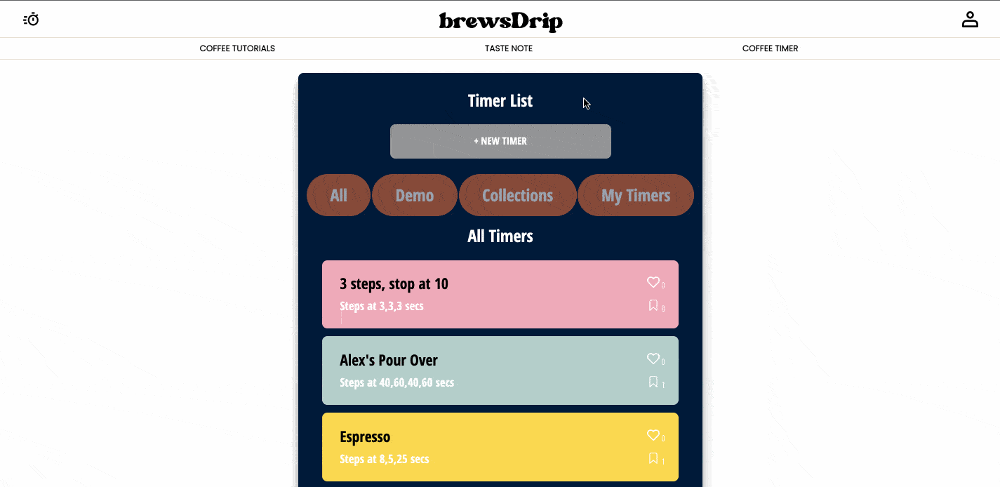
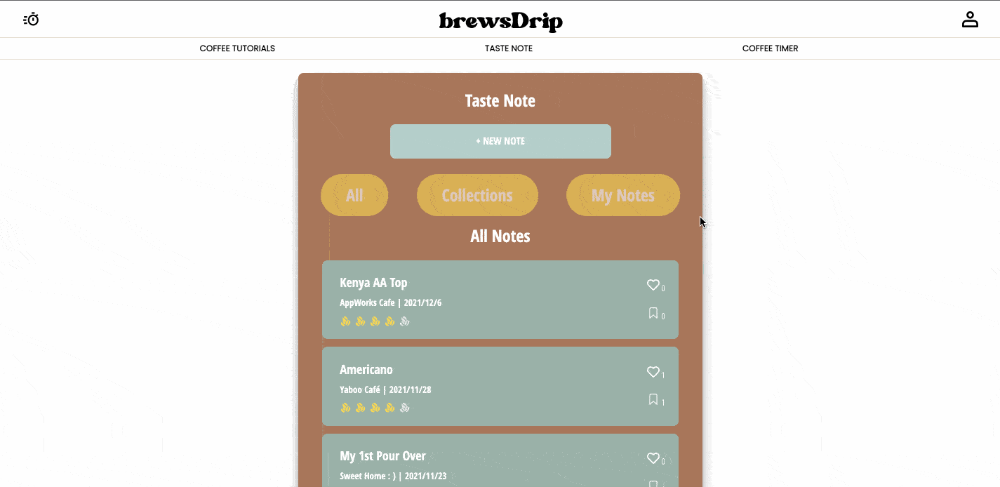

<h1 align='center'>brewsDrip</h1>

# Introduction

- With 7 years experience working in specialty coffee industry, helping people enjoy a good daily coffee is my long-term goal, therefore I created brewsDrip!
- It’s your best coffee pal that could share amazing coffee experience with friends.

# Features

- Coffee Tutorials: Articles of basic knowledge of brewing, drinks, and culture.
  . You could read through Coffee Tutorials and choose the method you would like to brew with.
- Personal Coffee Timer: User could brew easily with customized steps of timer
  includes alert sound & changing background-color after specific seconds.
- Coffee Taste Note: User could record on mobile device/notebook easily with
  flavor profile tags from Specialty Coffee Association.
- User could share notes & timers to friends via Facebook, Line, and copylink.

## Website link

brewsDrip website Link [Click here](https://brewsdrip.web.app/)

- You could sign up with email, FB or Google.
- Or login with FB or Google directly.
- Test Account:
  - User: test@email.io
  - Password: 111111

## Techniques

### Front-End

- ReactJS/ Redux/ React Router
- Styled-components
- Web Audio API
- Firebase
  - Authentication
  - Firestore Database
  - Storage
  - Hosting

### Miscellaneous

- compressorjs
- dotenv
- eslint
- @u-wave/react-vimeo
- react-icons
- react-share
- react-loading
- sweetalert2
- uuid

## Function Chart

## Features

- #### Change Profile Pic
  
- #### Create Personal Coffee Timer
  
- #### Use Personal Coffee Timer
  
- #### Use Personal Coffee Timer on Mobile Device
  
- #### Create Coffee Taste Note
  
- #### Edit Coffee Taste Note
  
- #### Share Coffee Taste Note
  
- #### Share Personal Coffee Timer

  

- #### Delete My Timer

  

- #### Delete My Note

  

## Future features

- Add one's own collected articles.
- User could search timer by brewing method.
- Search place in coffee taste note via google map api.
- Coffee Map:
  - User could find coffee shops via google map in website.
  - Coffee shop owner could add their information in coffee map.

## Contact

- Author: Alex Ku
- E-mail: liko0165@gmail.com
